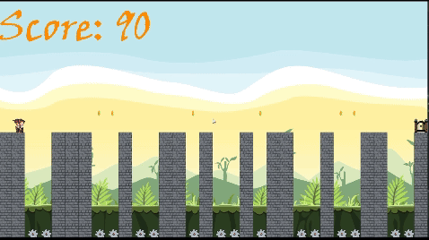

# Pygame - Platformer

Simple platformer game with path - following AI made using Python 3.9 and PyGame libary.

## Run

To play the game, open a Command Prompt in game's directory and enter following command:

```bash
python main.py
```
